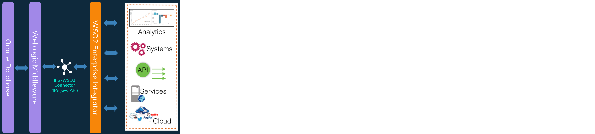

  
# IFS-WSO2 ESB Connector
The IFS-WSO2 Connector allows you to access Core database objects of IFS ERP from WSO2 Enterprise Integrator.

Connector was built using IFS JAVA Access Provider which utilizes an fully compatibility with the IFS framework and security. It opens endless possibilities of integrating IFS with other applications and business scenarios using WSO2 products and other connectors.
 
|  | 
|:--:| 
| *IFS WSO2 Connector overview* |

## Compatibility
IFS-WSO2 Connector is tested with IFS versions APP8, APP9, APP10 and with WSO2 EI 6.X.X, WSO2 MI 1.X.X

## Download and install the connector
If you are new to [WSO2 ]( https://wso2.com/)and haven’t install it before, first download and install [WSO2 EI]( https://wso2.com/integration/)
1. Download the latest [release](https://github.com/knakit/wso2-esb-connector-ifs/releases/latest) of the connector.
2. Open the Management Console of WSO2 EI
3. On the **Connectors** node, click **Add** to open the Add Connector page
4. Click **Choose File**, select the required connector ZIP file, and click **Upload**.  The connector should now appear in the Connectors list and is by default disabled.
5. Click on the **Disabled** status icon to enable connector.

## Configuring the connector operations
IFS-WSO2 Connector supports following IFS operations 
1. Execute SQL statement and retrieve records from IFS
2. Execute PL/SQL base method for NEW, MODIFY, REMOVE
3. Execute PL/SQL block and retrieves the values assigned for bind variables

To get started with **IFS-WSO2 Connector** see [Configure]( doc/config.md) section

## Building from the source

Follow the steps given below to build the **IFS-WSO2 Connector** from the source code.

1. Get a clone or download the source from [Github]( https://github.com/damithsj/Knak.it)
2. Copy following IFS jar files from IFS_HOME\repository\server\javaruntime\ into local workspace (eg. D:\work\Knak.it\lib)
- [x] ifs-fnd-ap.jar
- [x] ifs-fnd-base.jar
- [x] ifs-fnd-common.jar
3. Add the jar files to the project
- mvn install:install-file -Dfile=D:\work\Knak.it\lib\ifs-fnd-ap.jar -DgroupId=ifs.fnd -DartifactId=ifs-java-fnd-ap -Dversion=1.0 -Dpackaging=jar
- mvn install:install-file -Dfile=D:\work\Knak.it\lib\ifs-fnd-base.jar -DgroupId=ifs.fnd -DartifactId=ifs-java-fnd-base -Dversion=1.0 -Dpackaging=jar
- mvn install:install-file -Dfile=D:\work\Knak.it\lib\ifs-fnd-common.jar -DgroupId=ifs.fnd -DartifactId=ifs-java-fnd-common -Dversion=1.0 -Dpackaging=jar
- mvn install

## How you can contribute
**IFS-WSO2 Connector** is a result of my curiosity to test the possibilities of integrating IFS with other systems and having some fun with java coding. It’s not a final product so don’t expect much from it but executing an SQL or PL/SQL code from a web service provide enough potential to develop complex integrations.
I’m pleased to know your ideas and contribution to this project.
Easiest way is to get in touch with our mail [knakit.dev@gmail.com](mailto:knakit.dev@gmail.com)

>_IFS is a trademark of [IFSWORLD.COM]( https://www.ifsworld.com) and WSO2 is a trademark of [WSO2.COM]( https://wso2.com/). This product expects the fair use policy of the trademarks_
